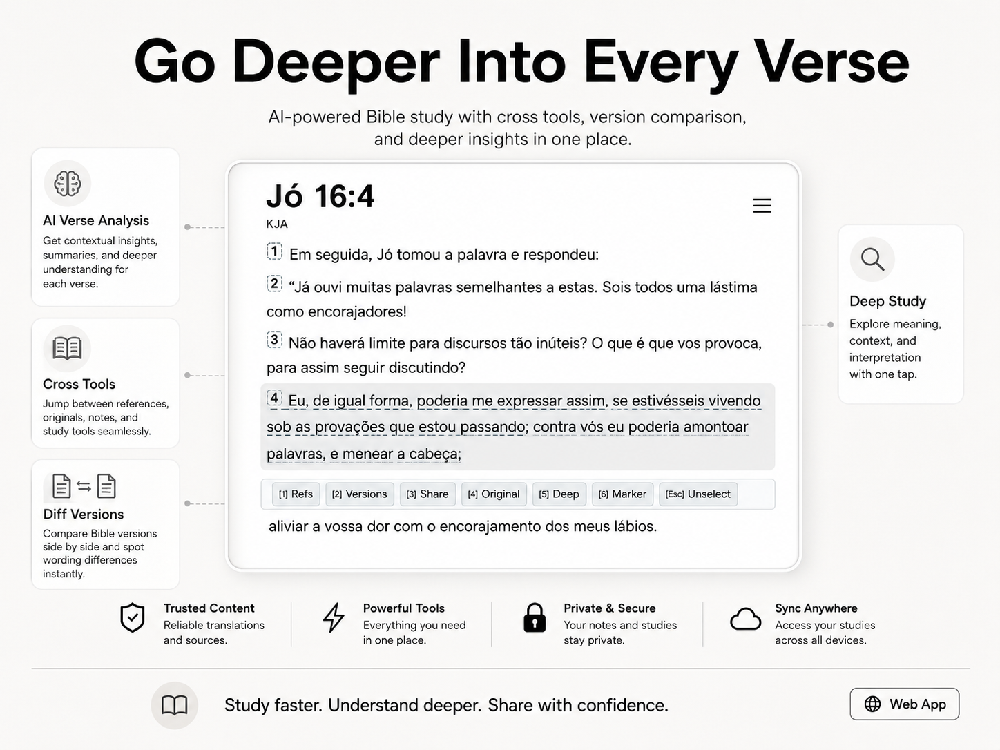
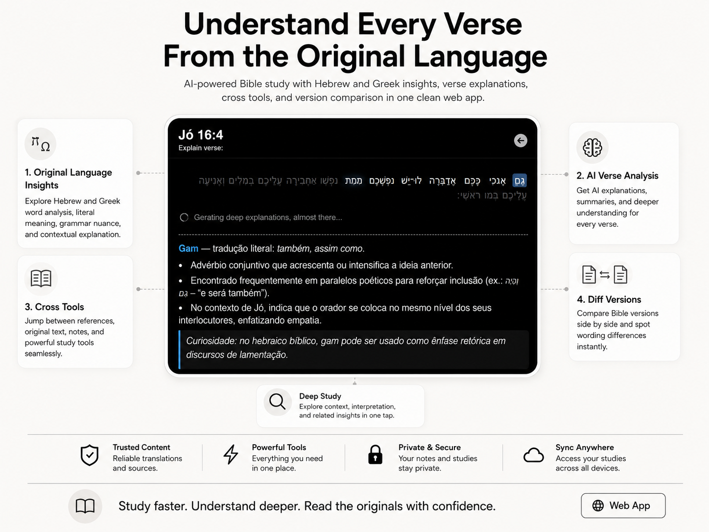

<p align="center">
  
</p>

<h1 align="center">Open Bible Study</h1>

<p align="center">
  App web rápido e minimalista para leitura/estudo bíblico — <strong>UI de leitura + API HTTP</strong> com versões em JSON locais.
</p>

<p align="center">
  <a href="README.md">English</a>
</p>

---

<p align="center">
  
</p>

<p align="center">
  
</p>

---

## O que é?

O **Open Bible Study** é um leitor bíblico leve, focado em velocidade e simplicidade, mas com ferramentas de “modo estudo” quando você precisar.

### Experiência principal

1. Escolha uma **versão**, um **livro** e um **capítulo**
2. Leia com uma UI limpa e **navegação** de capítulo anterior/próximo
3. Clique em um versículo para abrir uma barra de ações:
   - **Refs**: referências relacionadas (armazenadas no Postgres)
   - **Versions**: compare o mesmo versículo em várias versões (com diffs)
   - **Share**: copie links compartilháveis (+ opcionalmente o texto do versículo)
   - **Original**: mostra o texto no idioma original + explicações por token com IA
   - **Deep**: análise profunda com IA + referências cruzadas com links automáticos
   - **Marker**: salve marcadores de leitura nomeados (localStorage)

Também inclui:

- **Busca** (busca simples “livro/capítulo/verso” + busca profunda full-text)
- **API HTTP** (route handlers do Next.js) para consultar livros, versões e capítulos
- **Dados local-first**: as versões ficam como JSON dentro deste repositório

---

## Começando (Quickstart)

### Requisitos

- Node.js **18+** (20+ recomendado)
- Um gerenciador de pacotes: **pnpm** (recomendado), npm, yarn ou bun

### Instalar

```bash
pnpm install
```

### Rodar (desenvolvimento)

```bash
pnpm dev
```

- App: `http://localhost:3000`

**Nota:** `pnpm dev` executa os passos de geração de dados (`orig` + `parts`) antes de iniciar o Next.js.

### Build + produção

```bash
pnpm build
pnpm start
```

---

## Features

### Leitor

- Leitor de capítulos com navegação **anterior/próximo**
- Seleção de versículo com **barra de ações** (Refs / Versions / Share / Original / Deep / Marker)
- **Marcadores de leitura** salvos no navegador (localStorage)

### Ferramentas de estudo

- **Referências cruzadas**: crie/consulte referências entre versículos (requer Postgres)
- **Comparação de versões**: compare um versículo entre várias versões com destaque de diferenças
- **Idioma original**: obtém o texto original (Hebraico/Grego) do versículo para a tradução selecionada

### IA (opcional)

Se você configurar um provedor de IA (API compatível com Ollama), o app pode:

- Fazer streaming de **explicações por token** do idioma original (Explain)
- Fazer streaming de uma **análise profunda** conectando tradução → idioma original + teologia + referências cruzadas

### Busca

- Busca simples: padrões do tipo `Livro Capítulo:Verso`
- Busca profunda: full-text em versículos (via rota server)

---

## Variáveis de ambiente

Algumas features exigem serviços externos.

Crie um `.env.local`:

```bash
# --- IA (opcional, usado em /reader/explain e /reader/deep-analysis)
# Exemplo com Ollama: http://localhost:11434
AI_API_URL=http://localhost:11434
AI_API_MODEL=llama3.1
# Opcional (caso seu endpoint compatível com Ollama exija auth)
AI_OLLAMA_API_KEY=

# --- Postgres (obrigatório para a feature de References)
PG_HOST=localhost
PG_PORT=5432
PG_USER=postgres
PG_PASSWORD=postgres
PG_DATABASE=open_bible
```

Se você não quiser IA ou referências, ainda dá para usar o leitor + versões locais, mas rotas/funcionalidades que dependem desses serviços precisam ser desativadas/removidas ou configuradas corretamente.

---

## API

Base (local): `http://localhost:3000`

- `GET /api/books`
- `GET /api/versions`
- `GET /api/versions/:version_abbr/:book_abbr/:chapter_number`

Exemplo:

```bash
curl "http://localhost:3000/api/versions/NVI/Gn/1"
```

Resposta:

```json
{
  "version": "NVI",
  "book": {
    "name": "Gênesis",
    "abbrev": "Gn",
    "chapter": {
      "number": 1,
      "verses": ["No princípio...", "..."]
    }
  },
  "previous": { "abbrev": "...", "numChapter": 1 },
  "next": { "abbrev": "...", "numChapter": 2 }
}
```

---

## Formato dos dados

- Versões: `src/assets/versions/*.json`
- Partições por livro (para imports mais rápidos): `src/assets/versions/partitions/<versão>/<livro>.json`
- Metadados de livros usados pela UI: `src/assets/versions/partitions/meta.json`

---

## Deploy

Vercel é recomendado.

- Build: `pnpm build`
- Node: 18+

Se você habilitar IA ou features baseadas em Postgres, configure as variáveis de ambiente no seu provedor de deploy.

---

## Licença / nota legal

- Código-fonte: [MIT](LICENSE)
- Textos bíblicos: a permissão de uso/redistribuição depende da licença/copyright de cada versão.

Se você pretende publicar/redistribuir este app, garanta as permissões para todas as versões incluídas.
